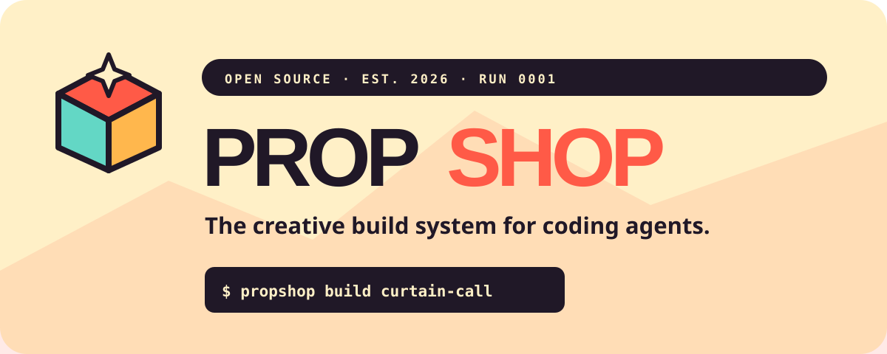

<p align="center">
  
</p>

<p align="center">
  <strong>Need a thing? Send it to PropShop.</strong>
</p>

<p align="center">
  <a href="https://www.npmjs.com/package/propshop"></a>
  <a href="https://github.com/DyrtyJax/propshop/actions/workflows/ci.yml"></a>
  <a href="LICENSE"></a>
</p>

PropShop turns creative asset requests into reproducible builds. A coding agent can describe what a project needs; specialist providers make the raw material; PropShop records, validates, compares, and promotes the result.

It is the missing workshop between an agent saying “this interface needs a satisfying glassy hover” and a production-ready file appearing in the repository.

> **Early workshop release:** The build contract is working. The adapter ecosystem is just beginning.

## The idea

```text
Fable / Sol / Codex
        │  writes or edits a Propfile
        ▼
    propshop build
        │
        ├── Quiver / StarVector        vector
        ├── audio.cpp / ElevenLabs     audio
        ├── ComfyUI / Replicate        raster + video
        └── Blender                    3D
        │
        ▼
hashed takes → compare → promote → production assets
```

PropShop does not try to be an image, audio, or 3D model. It provides the stable build layer around specialist tools:

- one declarative `Propfile.yaml`;
- capability-oriented provider adapters;
- immutable run records with prompts, model names, environment, and SHA-256 hashes;
- multiple takes without filename chaos;
- explicit promotion into production assets;
- a `Propfile.lock` recording exactly what was chosen.

## Dock a specialist module

PropShop is also a docking standard for community workflows. A module can carry one or more agent skills plus the scripts, schemas, validation, and adapter instructions that make specialist knowledge reusable. The creative judgment stays with the agent; the module supplies hard-won production memory, small deterministic props, and a stable interface.

Modules are advisory by default. They should not force a provider, model, take count, shot grammar, or creative framework when the agent has a better route. Creative modules should expose visible progress and invite a few high-leverage human decisions before taste-defining or expensive branches. See [Authoring modules that help without taking over](docs/module-authoring.md).

Attach a module already on disk:

```bash
propshop module inspect music-video-explainer
propshop module attach music-video-explainer --agent claude --project ./off-the-rails
```

Or dock one directly from its own Git repository:

```bash
propshop module add https://github.com/someone/propshop-great-foley.git \
  --ref v1.2.0 \
  --agent codex \
  --project .
```

Git modules are copied project-locally into the target agent's standard skills directory. PropShop records the resolved commit, module-manifest hash, copied-payload hash and size, declared license, and pinned upstream workflows under `.propshop/modules/`. Dependency caches and Git metadata are excluded. A module may adapt an open-source workflow without vendoring it, but it must declare the upstream URL, revision, license, and integration mode.

The v1 manifest is deliberately small:

```yaml
schemaVersion: 1
name: great-foley
version: 1.2.0
description: Production-tested footsteps and practical sound effects.
license: Apache-2.0
capabilities: [audio.sfx.generate, audio.sfx.finish]
skills:
  - name: produce-foley
    path: skills/produce-foley
    interaction: adaptive
upstreams:
  - name: specialist-workflow
    url: https://github.com/example/specialist-workflow
    revision: 4d9c0e1
    license: MIT
    integration: adapted
```

There is no central creative gate and no requirement that modules share a provider. A module can use a hosted API, a local model, a deterministic renderer, or a framework that does not exist yet, as long as its boundaries and provenance remain legible.

The upstream modes keep “wrap an excellent open workflow” honest:

- `external` calls or installs the upstream without copying it;
- `adapted` re-expresses the workflow as a PropShop-native recipe or skill;
- `vendored` includes upstream code and therefore must preserve its license and notices.

Treat a community module like any executable development dependency: inspect its manifest and skill instructions before giving its agent credentials or allowing paid calls.

`skills[].interaction` is optional metadata for hosts and humans: `autonomous` normally runs through, `adaptive` decides when review is useful, and `checkpointed` intentionally preserves human promotion points. The skill instructions remain authoritative, and an explicit user delegation can still authorize autonomous choices.

The capability is the building block. A prop such as `audio.sfx.generate` can move between a local runtime, a warm model server, Replicate, fal, or a future API without changing its identity or quality policy. See [Building blocks, not backends](docs/architecture/building-blocks.md).

The same is now true for `vector.svg.generate`: use Quiver's native-vector API today, wrap StarVector/InternSVG/OpenPencil workflows behind the versioned command protocol, or bring another adapter later. PropShop applies the same parsing, safety, structural policy, comparison, and promotion contract to every SVG.

## Open a shop

PropShop currently requires Node.js 20 or newer.

```bash
npm install --global propshop
propshop init my-project
cd my-project
propshop plan
propshop build
```

Or take a quick look without installing globally:

```bash
npx propshop@latest init my-project
```

To run the repository's complete retro-interface example from source:

```bash
git clone https://github.com/DyrtyJax/propshop.git
cd propshop
npm install && npm run build
npm link
propshop plan --file examples/retro-interface/Propfile.yaml
propshop build --file examples/retro-interface/Propfile.yaml
propshop runs --file examples/retro-interface/Propfile.yaml
```

The example uses the deterministic `mock` adapter, so it needs no keys and spends no money. It creates branded preview cards while exercising the real run ledger, hashing, variants, and promotion flow.

## A Propfile

```yaml
version: 1
project: haunted-arcade
outputDir: props

style:
  description: CRT glow and printed ephemera; charming, not cyberpunk
  palette: ["#17121f", "#ff4db8", "#f4efff"]
  references: []

providers:
  preview:
    adapter: mock
  replicate:
    adapter: replicate
    env: REPLICATE_API_TOKEN

props:
  - id: portal-icon
    kind: vector
    capability: vector.svg.generate
    prompt: An ornate dimensional portal with a handmade 2002 web-game feel
    provider: preview
    variants: 3
    tags: [navigation, icon]

  - id: menu-hover
    kind: sfx
    capability: audio.sfx.generate
    prompt: A short glassy arcade hover with a dusty CRT click
    provider: replicate
    model: stability-ai/stable-audio-3
    variants: 4
    input:
      durationSeconds: 0.8
      seed: locked
      negativePrompt: music, speech, long reverb tail
```

Portable parameters belong under `input`; the adapter always injects the prop's prompt. Experimental provider settings live under `input.advanced.<adapter>`, preventing one model's flags from becoming PropShop's public API.

## Commands

| Command | Job |
| --- | --- |
| `propshop init` | Open a new shop with a starter Propfile |
| `propshop validate` | Validate references, providers, IDs, and inputs |
| `propshop plan [ids...]` | Show the call sheet without generating anything |
| `propshop doctor` | Check adapters and credentials |
| `propshop auth login <provider>` | Connect through an official provider CLI or the OS keychain |
| `propshop auth status [provider]` | Show credential sources without revealing tokens |
| `propshop auth logout <provider>` | Remove provider-managed or keychain credentials |
| `propshop module inspect <path>` | Validate a local community module |
| `propshop module attach <path>` | Dock a local module into Codex or Claude |
| `propshop module add <git-url>` | Dock a Git module and pin the resolved commit |
| `propshop module list` | List modules attached to a project |
| `propshop build [ids...]` | Generate takes and write an immutable run |
| `propshop runs` | List recent runs |
| `propshop show <run>` | Inspect complete provenance for a run |
| `propshop compare <id> --run <run>` | Compare takes using measured artifact metadata and checks |
| `propshop promote <id> --run <run> --take <n>` | Promote one approved take into production and lock it |

## What exists today

- `mock` adapter for deterministic, keyless development and CI;
- generic Replicate adapter for hosted models that return downloadable artifacts;
- `audio-cpp` adapter with safe CLI and warm-server transports;
- `quiver` adapter for hosted native text-to-SVG generation;
- `svg-command` adapter protocol for local models and creative frameworks;
- stable capability IDs independent of models and providers;
- locked, explicit, and fresh seed policies per take;
- native WAV inspection for format, duration, RMS, peak, clipping, DC offset, and silence;
- native SVG parsing for geometry, complexity, accessibility, external content, and active-content safety;
- enforceable audio quality policies and take comparison;
- enforceable SVG structural budgets without pretending they replace human taste;
- YAML validation with useful errors;
- selective builds and up to 16 variants per prop;
- append-only event journals, atomic run views, and content hashes;
- promotion ledger in `Propfile.lock`;
- tests on Node.js 20 and 22.

Start with the [audio.cpp adapter guide](docs/adapters/audio-cpp.md) and [SVG module guide](docs/adapters/svg.md). You can also inspect the [audio](docs/audio-backends.md) and [vector](docs/vector-backends.md) backend field guides, run the keyless [SVG command example](examples/svg-command/Propfile.yaml), or configure the combined [audio + SVG Propfile](examples/mixed-media/Propfile.yaml).

Provider access stays outside the Propfile. See [provider authentication](docs/authentication.md) for browser login, OS-keychain storage, environment precedence, and noninteractive CI guidance.

Maintainers can follow the [trusted publishing release guide](docs/releasing.md) to publish through GitHub Actions without npm tokens or expiring OTP codes.

## Test audio and SVG together

Configure the audio.cpp executable/model paths and export a Quiver API key in [the mixed-media example](examples/mixed-media/Propfile.yaml), then:

```bash
propshop doctor --file examples/mixed-media/Propfile.yaml
propshop build --file examples/mixed-media/Propfile.yaml
propshop compare menu-hover --run <run-id> --file examples/mixed-media/Propfile.yaml
propshop compare portal-mark --run <run-id> --file examples/mixed-media/Propfile.yaml
```

To exercise the SVG kernel and local-driver contract without a model or API key:

```bash
propshop build --file examples/svg-command/Propfile.yaml
```

## Where contributors can make this fun

The highest-value next steps are deliberately separable:

1. **MOSS-SoundEffect v2 adapter** as a permissively licensed specialist SFX path.
2. **Rendered SVG contact sheets** with clipping, empty-space, and visual-salience advice.
3. **External adapter package/test kit** built from the working SVG command protocol.
4. **Deterministic audio finishing** with loudness profiles, derivatives, and seamless-loop scoring.
5. **OpenPencil editing station** between raw vector generation and final promotion.
6. **ComfyUI adapter** that captures workflow, model hashes, seed, and custom-node revisions.

See [CONTRIBUTING.md](CONTRIBUTING.md) before taking a prop ticket.

## Design principle

The core stays broad by staying small. It owns recipes, runs, artifacts, validation, and promotion. It does not absorb the specialist creative tools it coordinates.

PropShop is licensed under [Apache 2.0](LICENSE). Generated assets and model weights may carry their own licenses; adapters should record those before a prop is promoted.
